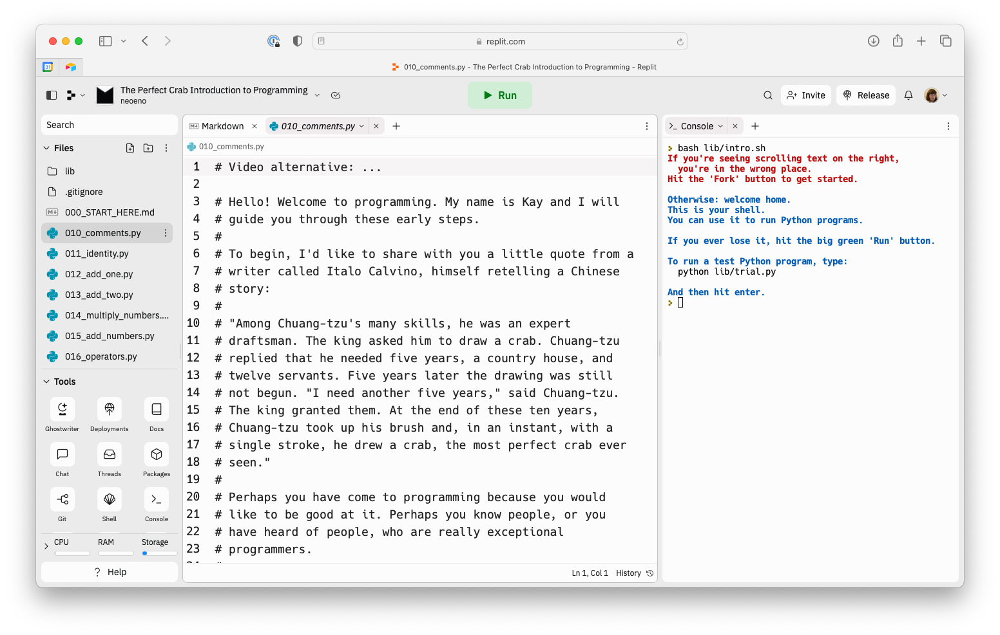

# The Perfect Crab Introduction to Programming

Welcome!

This is a series of exercises designed to help you learn the
fundamentals of programming necessary to succeed in the
Makers coding assessment. We'll be using Python, but the
ideas will apply to any language.

## How do I get started?

> **Note**  
> If you like videos, follow this [replit video
> guide](https://youtu.be/c0GdcmPfKL4) to get set up.
> Otherwise, keep reading below.

[Open up the replit space.](https://replit.com/@neoeno/The-Perfect-Crab-Introduction-to-Programming)

Click the 'Fork' button on the right. This will open up the
programming interface you will use to learn.

If you're confident using your own local development setup
and you have Python 3 installed, you can instead clone this
repository and work through it that way. However only do
this if you are sure you know what you're doing.

## How do I use the replit interface?

The interface is made by an organisation called replit. We
will call it the IDE.

You will need to engage with three parts of it:

* The file panel on your left, working from this file downwards.
* The code panel (if you're on replit now, that's this one)
  where you'll read and write code.
* The shell panel to the right, where you'll run code.

To set up and learn how to use the interface, please follow
the [replit IDE setup video](https://youtu.be/c0GdcmPfKL4).
This video has subtitles.

You may find the default replit theme hard to read. We have
created two themes which combine good contrast and
readability. I would recommend you use one of them:

* [Makers Reader Theme (Light)](https://replit.com/theme/@neoeno/makers-reader)
* [Makers Reader Theme (Dark)](https://replit.com/theme/@neoeno/makers-reader-dark)

When you're done setting it up, it should look something like this:



## How to read the material

The learning materials are files of code. They look a bit
like this:

```python
def just_return_it(num):
  return num

# This is a function. A function is a reusable block of code.
```

The first two lines are code. This is what you will be
learning how to create.

That last line starting with a `#` is a comment. We will
talk you through the ideas behind the code using comments.

You should work through each file sequentially, starting
with `010_comments.py`. You should work through each file
top to bottom.

At the end of the material there are four optional files.
You don't need to complete these to be ready for the
assessment, but they might help.

## What if I would prefer to watch than to read?

There are video alternatives for each file that you can
follow along with. You can find them as a link at the top of
each file.

## I have some feedback about the material

We would receive it with gratitude. [You can give us
feedback
here.](https://airtable.com/shrDOnkLFDkRiOHmU?prefill_Repository=IntroToProgramming)
